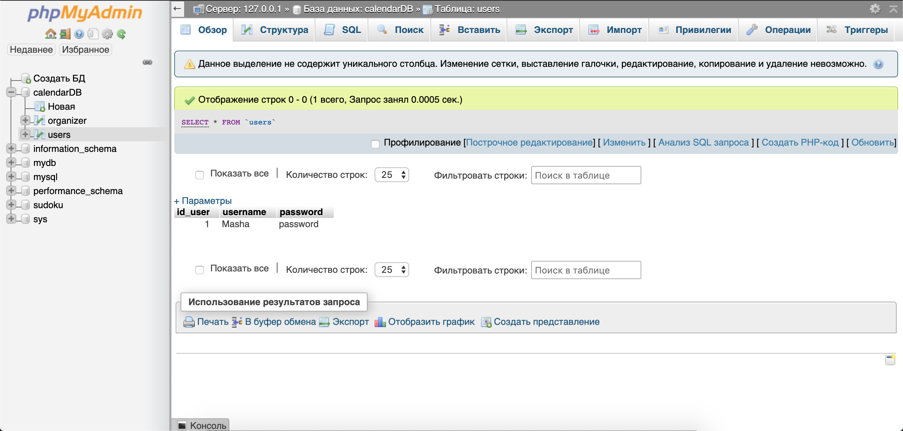
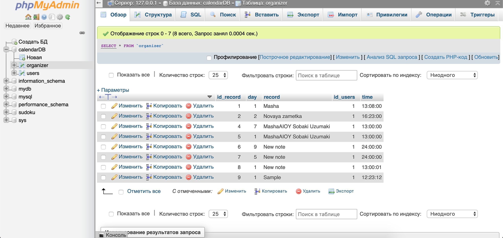

# Calendar-June
## Курсовая работа по клиент-серверным приложениям
Разработать органайзер на текущий месяц. На главном экране должен выводиться Календарь на текущий месяц. При щелчке на календарном дне, должна выводиться информация по этому дню. В том случае, если пользователь авторизирован, то должна быть обеспечена возможность редактирования и добавления информации по указанному дню.
## Database - MySQL

